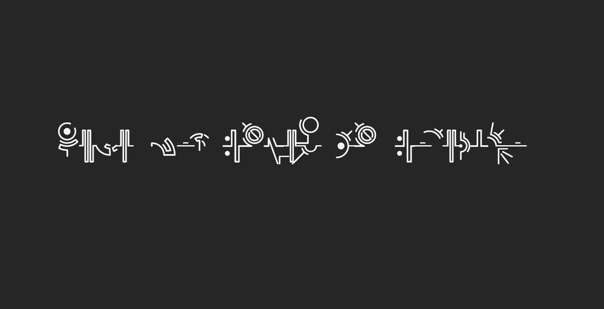
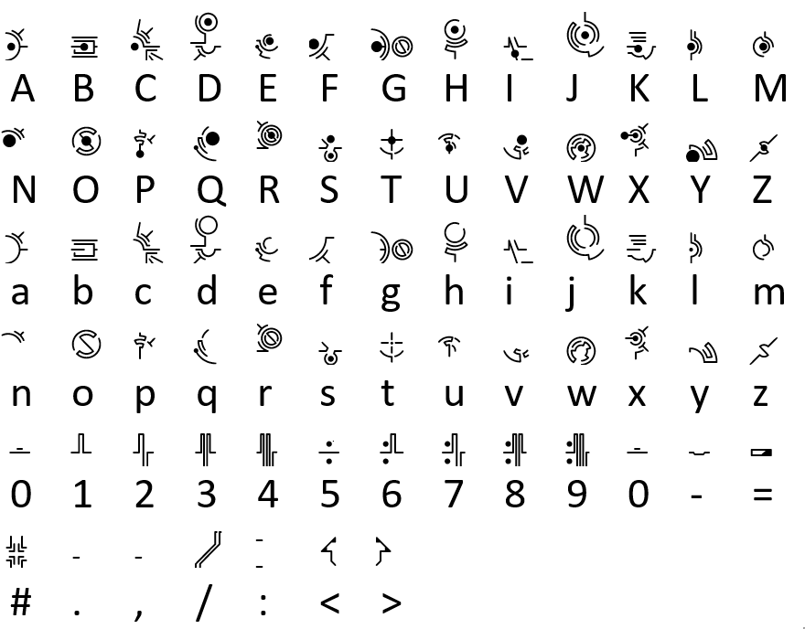

# Aria of the Lost Code

> VishwaCTF{H4v3_y0u_7ri3d_Ar_70n3L1c0}

It was a simple challenge, we were given a image of bunch of rune like symbols. By reverse image search on google we found that it is a Hymmnos Language. We got the translation table from [here](https://artonelico.fandom.com/wiki/Hymmnos_Language).

We translated the symbols to get the flag.