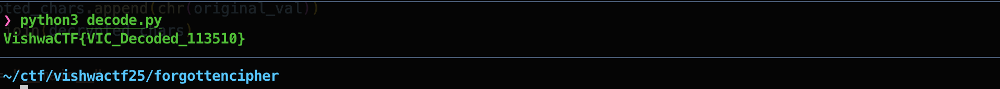

# Forgotten Cipher

> VishwaCTF{VIC_Decoded_113510}

This one was little bit tricky. Encrypted text and some key evoluation formula was given. We have to decrypt the text. description was pointing towards the modified VIC cipher.

```plaintext
Encrypted Message :- 0d4ac648a2f0bee7bccf0231c35e13ba7bc93a2d8f7d9498885e3f4998

Key Evolution Formula :- K(n) = [ K(n−1) × 3 + index ] mod 256
```

With the help of Wikipedia & ChatGPT, we understood the VIC cipher first. Getting the key was easy as basekey is single digit in VIC cipher (0 - 9).

After little bit of fidling we created the following script to decrypt the message. Tries all basekeys (10)

```python

def rotate_left(val, r_bits, max_bits=8):
    return ((val << r_bits) & (2**max_bits - 1)) | (val >> (max_bits - r_bits))

def rotate_right(val, r_bits, max_bits=8):
    return (val >> r_bits) | ((val << (max_bits - r_bits)) & (2**max_bits - 1))

def encrypt(plaintext, base_key):
    encrypted_bytes = []
    key = base_key
    for i, char in enumerate(plaintext):
        # K(n) = (K(n-1) * 3 + index) mod 256
        key = (key * 3 + i) % 256
        xored = ord(char) ^ key
        if i % 2 == 0:
            shifted = rotate_left(xored, 2)
        else:
            shifted = rotate_right(xored, 2)
        encrypted_bytes.append(shifted)
    return ''.join(f'{b:02x}' for b in encrypted_bytes)

def decrypt(ciphertext, base_key):
    encrypted_bytes = [int(ciphertext[i:i+2], 16) for i in range(0, len(ciphertext), 2)]
    decrypted_chars = []
    key = base_key
    for i, b in enumerate(encrypted_bytes):
        if i % 2 == 0:
            unshifted = rotate_right(b, 2)
        else:
            unshifted = rotate_left(b, 2)
        # Evolve key in the same way as during encryption
        key = (key * 3 + i) % 256
        original_val = unshifted ^ key
        decrypted_chars.append(chr(original_val))
    return ''.join(decrypted_chars)

if __name__ == "__main__":
    enc_text = "0d4ac648a2f0bee7bccf0231c35e13ba7bc93a2d8f7d9498885e3f4998"
    for i in range(0, 10):
        v = decrypt(enc_text, i)
        if 'Vishwa' in v:
            print(v)
            break

```

