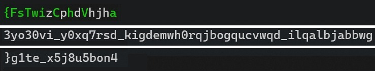

# Patterns

> VishwaCTF{u_g07_g00d_3y35_18e45tg}

We presented with a 3 strings, and first one is having colors on some letters.



We can see that the first string is having green color on some letters, and it is obvious that those letters form a start of the flag "VishwaCTF{". So as name suggest we have to find the pattern and apply it to other strings.

If we give index to every charater in first string from 1 to 16 and then take the numbers in order of the "VishwaCTF{" we get the following.

```
V  i s h  w a  C T F {
12 6 3 10 5 16 8 4 2 1
```

We can see something related to `/2` happing there, from 12 to 3, 10 to 5, 16 to 1. Now we need to find the link between 3-10, 5-16. It didn't take much time to realize that the link is `3x + 1`.

So we got the pattern, but we haven't solved the mistory of start of the sequence. We just did obvious thing, collected the pattern from every stating location of string, printed it out. One with meaning will be our flag.

So here is the script we quickily wrote to solve this, and it gave us the flag.

```python
s1 = "{FsTwizCphdVhjha"
s2 = "3yo30vi_y0xq7rsd_kigdemwh0rqjbogqucvwqd_ilqalbjabbwg"
s3 = "}g1te_x5j8u5bon4"


def get_pattern(n, context):
    # if len(context) > 100: return
    if n in context: return

    context.append(n)
    if n % 2 == 0:
        get_pattern(n // 2, context)
    else:
        get_pattern(3*n + 1, context)

def get_chars(st, pat):
    s = ''
    for i in pat:
        if i > len(st): return ''
        s += st[i-1]
    return s


pat = []
get_pattern(12, pat)
print(pat)

for i in range(1, len(s1)):
    pat = []
    get_pattern(i, pat)
    print(i, len(pat), get_chars(s1, pat))

print("========================================")

for i in range(1, len(s2)):
    pat = []
    get_pattern(i, pat)
    print(i, len(pat), get_chars(s2, pat))

print("========================================")

for i in range(1, len(s3)):
    pat = []
    get_pattern(i, pat)
    print(i, len(pat), get_chars(s3, pat))
```