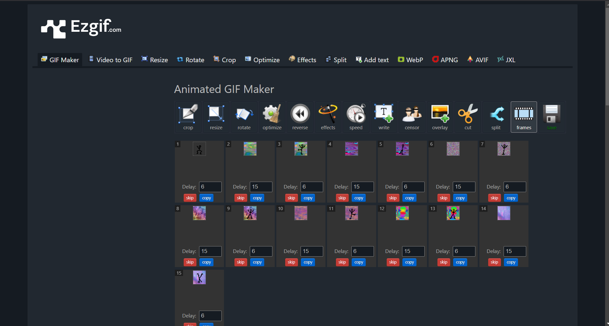
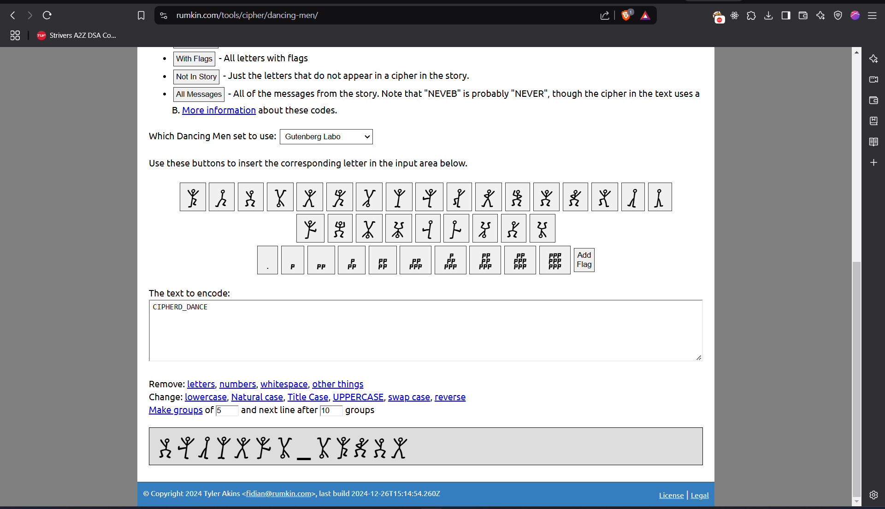

# Rhythmic Cipher

> VishwaCTF{CIPHERED_DANCE}

This cipher was the Dancing Men Cipher 
In exiftool we got the website to extract gif into individual images 

Then we found the cipher website and solved the challenge 

