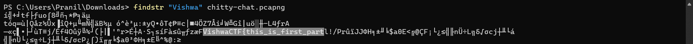
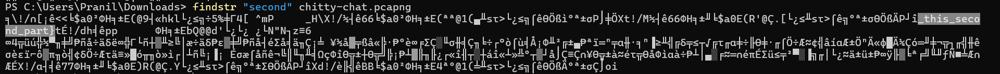

# Leaky Stream 
> VishwaCTF{this_is_first_part_this_second_part}

The challenge had a pcapng file. Just running the `findstr "Vishwa" chitty-chat.pcapng` command on it revealed the first part of the flag which was `VishwaCTF{this_is_first_part` .

Seeing this I ran `findstr "second" chitty-chat.pcapng` which revealed the second part of the flag `_this_second_part}`

