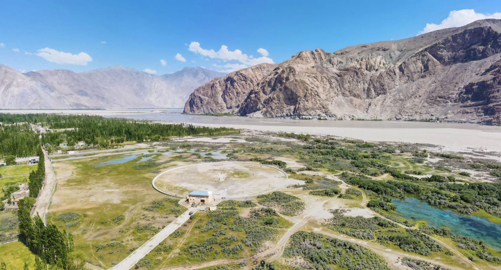
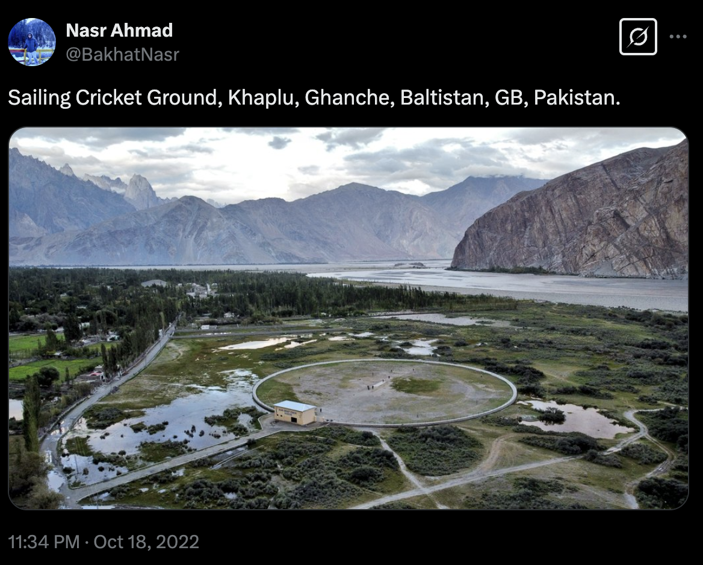

# Stadium!!

> VishwaCTF{Saling_Cricket_Stadium_Ghanche}

We have a picture of some stadium.

By reverse image searching, we can find a X post describing the name.

We had to submit the name of the stadium as the flag, we found the exact name of stadium from google maps.

