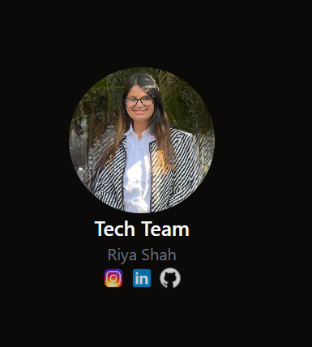
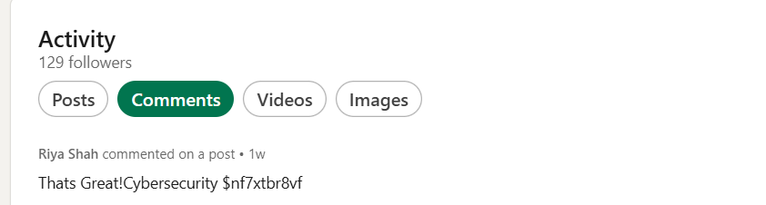
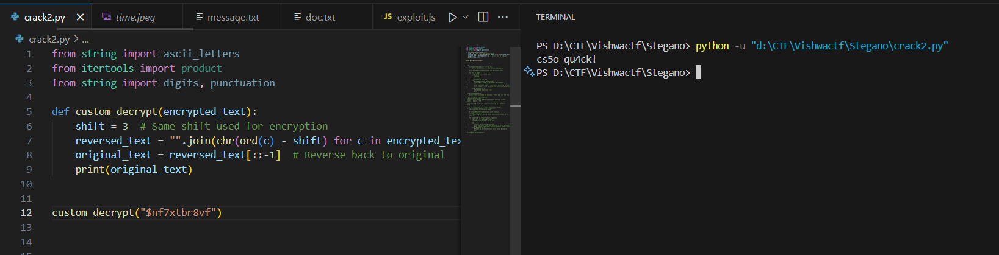

# The Lecture Code

> VishwaCTF{cs50_qu4ck!}

From our Heroes section we got the writer's github Riya Shah 

 

Then we checkout her github we got the cs50cybersecurity repo crack2.py was the real file decoding the cipher 

On LinkedIn we got the cipher and we solved it using the decoder given

