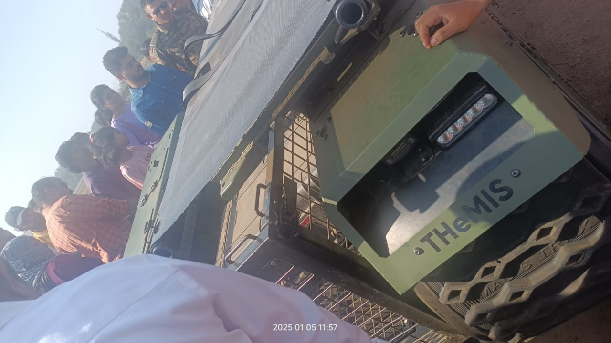

# The Summit

> VishwaCTF{18.51,73.89_Devendra Fadnavis}

We were presented with photo of THeMIS tank with timestamp 2025-01-05 11:57. We need to find the location of the event photo was refering to, and also need to find the name of Guest.

Quick search on google for identifying th event related to Army on 2025-01-05, we found that the event was "Army Mela 2025" hosted at "RWITC Grounds, Pune" and Guest was CM Devendra Fadanvis.

We might have got first blood if Flag format was given correctly, spce between the name was not specified in the flag format, we were trying DevendraFadnavis, Devendra_Fadnavis.. We were hold that flag over 10 mins. Eventually getting the 3rd blood.

For fun we also pinpoint the location where THeMIS tank was placed in the event.