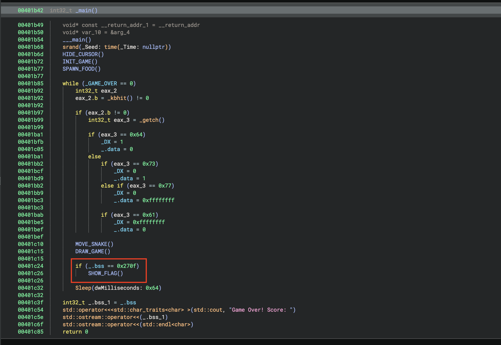
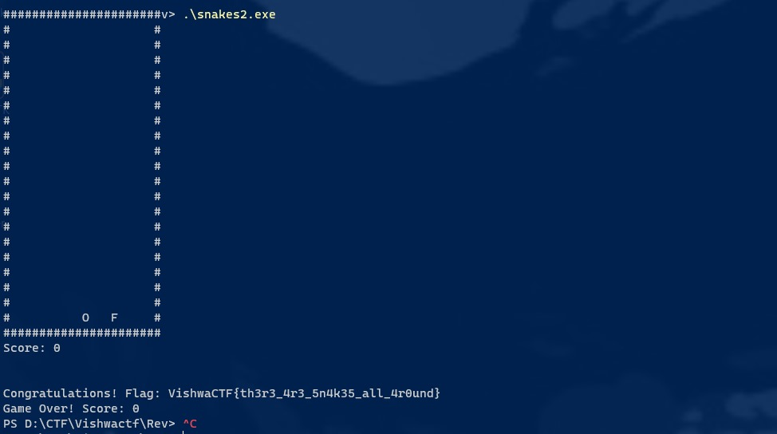

# Hungry Friends

> VishwaCTF{th3r3_4r3_5n4k35_all_4round}

We got the binary file `snakes.exe`. Which was someting like snake game. By disassembling the exe in binary ninja, I found `SHOW_FLAG()` function is called on certain condition.

As it is completely offline challenge i.e flag is present in binary itself, There are 2 options to solve this either reverse engineer the condition or patch the binary to always call `SHOW_FLAG()` function.
We choose the easy way to patch the binary. and got the flag.

