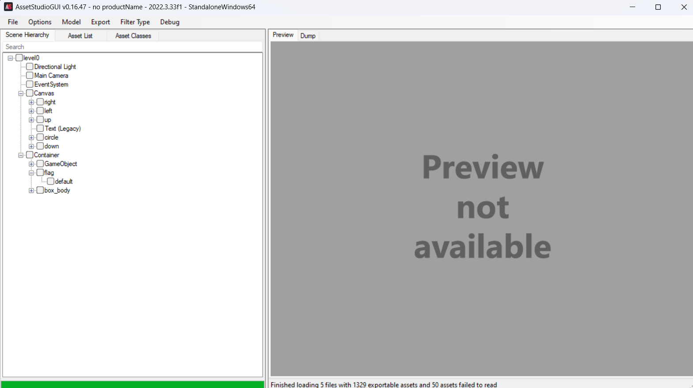
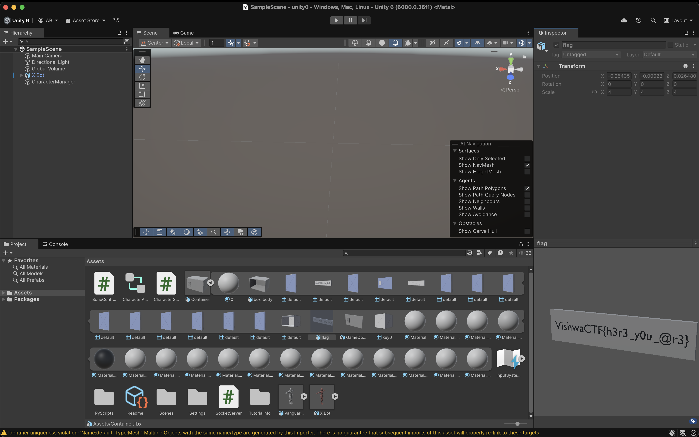

# Safe Box

> VishwaCTF{h3r3_y0u_@r3}

Unity Challenge 🙄
After running the game we see the big box floating at center of the screen and We can interact with it. We know flag is inside the box as soon as we start the game. Challenge was stright forward from onwards.

We uses `AssetStudio` to extract the assets from the game. We found the `Container.fbx`. As Unity was already installed on my machine, I imported it and found the flag inside the box.

