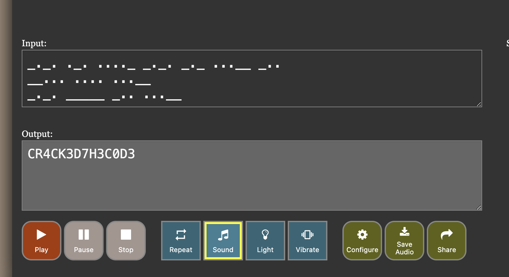

# Echoes Of The Unknown

> VishwaCTF{CR4CK3D7H3C0D3}

It was a Morse Code 
We got he all the thing from the Sonic Visualiser, and we have to dictate the Morse Code audio waves to form of `.` and `_` and then decode it to get the flag. We were getting trouble in decoding the Morse Code directly from the audio format due to elongated waves. So we decided to convert the audio to a spectrogram and then decode the Morse Code from the spectrogram. That was quick and easy.

