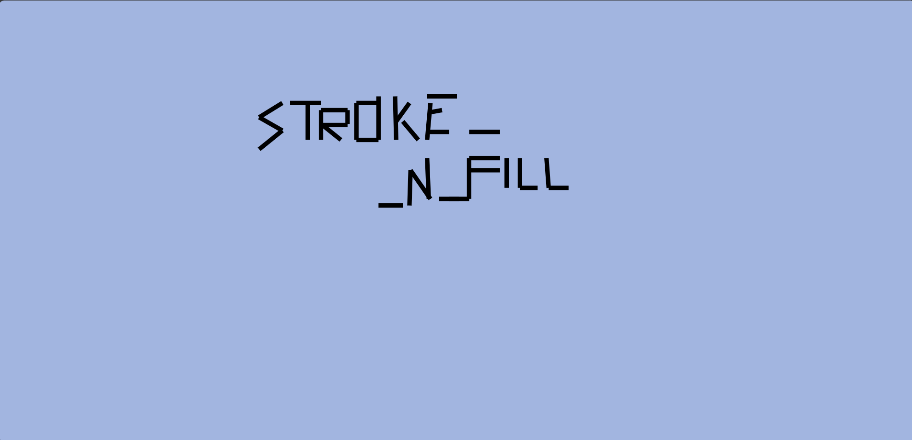

# Spilled Paint Water
We were given an SVG file. Upon opening it, we only saw a solid blue screen, with no obvious clues.
Since SVG is an XML-based format, we inspected the file's code. A key observation was the presence of a clipPath tag:
```xml
<clipPath id="clipArea">
    <rect x="1000" y="1000" width="200" height="200"/>
  </clipPath>  
  <g clip-path="url(#clipArea)"></g>
```
  
This snippet clips parts of the drawing, making them invisible. Removing this did not reveal anything, so we investigated further.

After deeper inspection, we noticed that the stroke color matched the background, making any strokes effectively invisible. By modifying all stroke colors to black (#000000), the hidden flag was revealed:
> VishwaCTF{STROKE_N_FILL}


