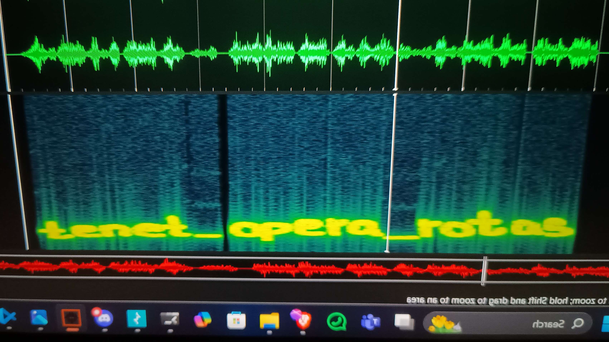
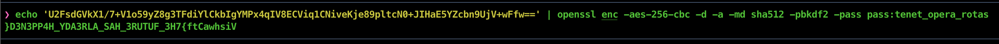
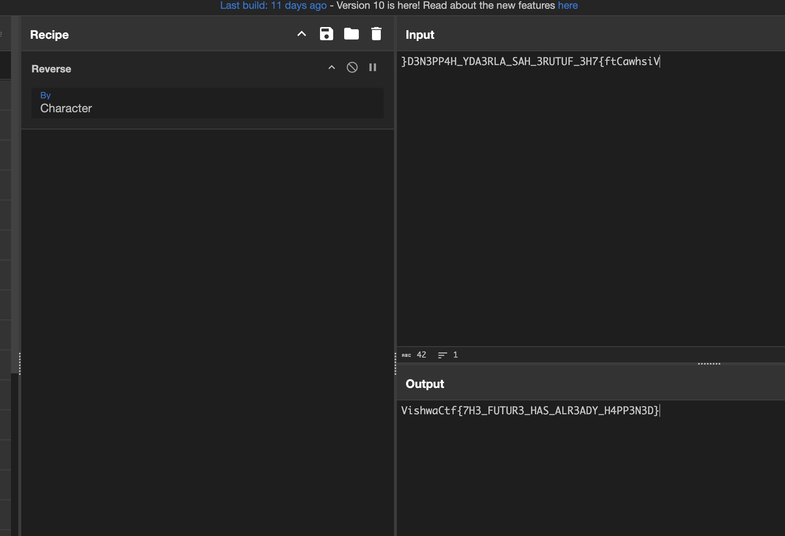

# TENET

> VishwaCtf{7H3_FUTUR3_HAS_ALR3ADY_H4PP3N3D}

This is one of my favourite chals 

sator_arepo_tenet was password for the stegseek or steghide 

Then we got a file named flag.txt and we need to decrypt that 
U2FsdGVkX1/7+V1o59yZ8g3TFdiYlCkbIgYMPx4qIV8ECViq1CNiveKje89pltcN
0+JIHaE5YZcbn9UjV+wFfw== this was the cipher 

 

In cyberchef we reversed it and got the flag

