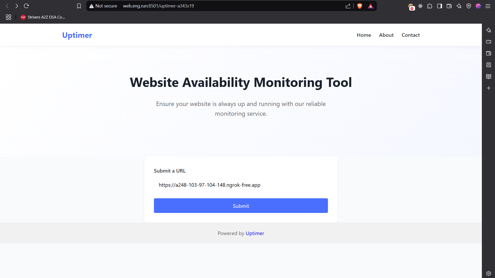
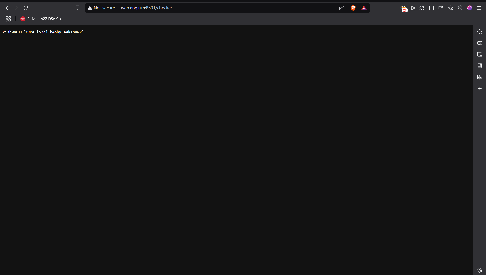

# Are We Up?

Strange One, This challenge was not provided any description nor any instance to connect. So first we were confused a lot.

As we know instances weare spawned on port range 8000-9000, I ran nmap scan on that port range. Wrote a script which will try to fetch the title of the page on ports given by nmap, to eliminate other challenge instances. and we got title "Server Status" on port `8501`.

After the hint from organizers, we found out there is open port on vishwaCTF server. hosting the same server but at the footer it was mentioned that the instance is running on port `8501`.

From here actual challenge started, We got simple templeted page (taken from codepen) of server status. But we foundout another endpoint in the footer. `/uptimer-a343s19` & `/checker` which taking input url and loading its content.



Yehh its SSRF, We tried the combinations of localhost but they were banned. So we can't access localhost directly, then what we can do? Use the redirecion if supported. We quickly hooked python server which will give 302 redirection to localhost. proxied through ngrok. When we requested our ngrok url, we got the flag.

One key detail the templeted page was suggesting the server is running on `http://localhost:8080` and flag is at location `/flag`, so we have to access `http://localhost:8080/flag` to get the flag. That's what we did.

```python
from flask import Flask, Response
from flask_cors import CORS

app = Flask(__name__)

CORS (app)

@app.route('/')
def home():
    response = Response (status=302)
    response.headers['Location'] = 'http://127.0.0.1:8080/flag'
    return response

if __name__ == "__main__":
    app.run(debug=True)
```

