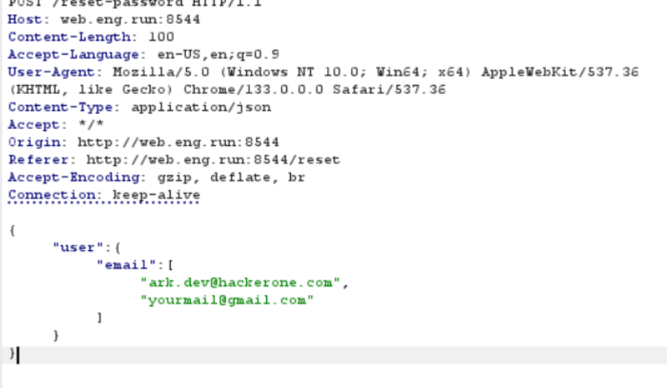
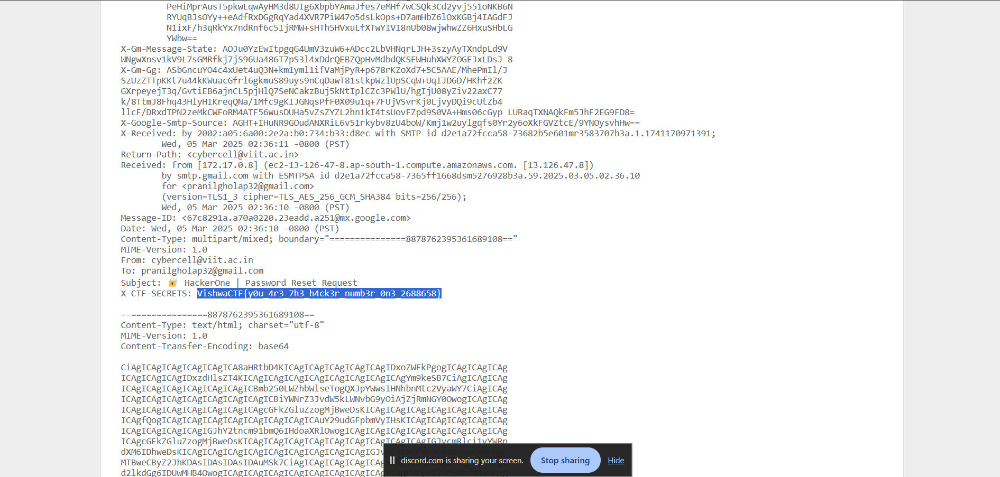

# Forgot-H1-Login
This web challenge was dedicated to one of VishwaCTF’s sponsors, HackerOne.

We explored the website for quite some time but initially found nothing useful. Shifting our focus to the OTP functionality, I first attempted using my Gmail account to receive an OTP, but it wasn’t accepted. Then, we tried an email discovered during our initial reconnaissance: ark.dev@hackerone.com. However, there was no way to retrieve the OTP—until we had an idea: modifying the request to append another email address after the HackerOne email.

And just like that—voilà! We received the OTP! 🎉 But our excitement was short-lived, as the OTP wasn't being accepted. 😞

After some trial and error, we decided to inspect the email's source code. That’s when we found it—the flag was hidden in the X-CTF-Secrets header!
> VishwaCTF{y0u_4r3_7h3_h4ck3r_numb3r_0n3_2688658}

While it was satisfying to solve the challenge, I couldn’t help but feel a little disappointed that it ended so abruptly. I had expected to exploit the site further after obtaining the OTP. Nonetheless, it was a fun and interesting challenge!
