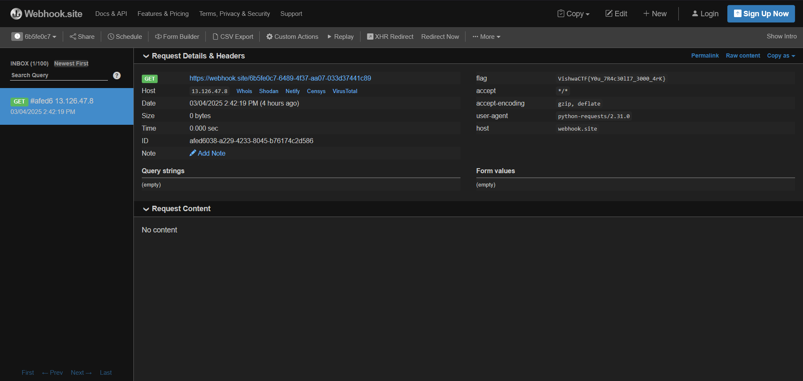

# Scan-It-To-Stay-Safe
This was an easy web challenge, but we hit a dead end for way too long due to an oversight. 😔

It was obvious that this was an SSRF, and we threw every payload we could think of at it, but nothing seemed to work. Meanwhile, the high number of solves only added to our frustration.

After stepping away and coming back with a fresh mind, I decided to take another look at the webhook request—just in case we had missed something. And there it was—the flag, sitting right in the flag header the whole time!

It’s crazy how we overlooked it at first, but lesson learned: always double-check the responses! 😅
> VishwaCTF{Y0u_7R4c30lI7_3000_4rK}

