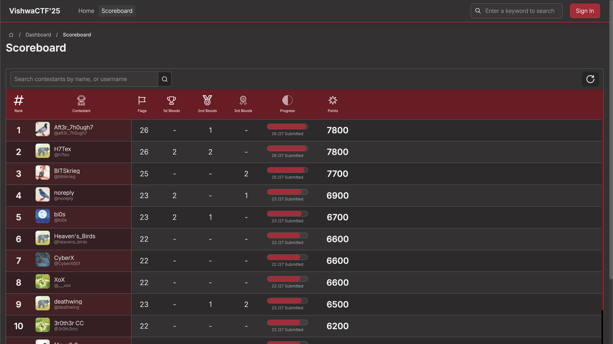

# VishwaCTF 25 Writeups @Deathwing

Team Deathwing participated in VishwaCTF 2025 and secured 7th position. (9th, later promoted to 7th due to disqualification of some teams). This CTF was organized by VishwaCTF and was held on 3rd March 2025.

## Review

The overall CTF was good and had a variety of challenges. But as compared to the previous CTF arranged by VishwaCTF, this time there were some issues. Firstly, the infrastructure was very unstable, we faced many long blackouts and some of the challenges were removed then added back again and again. Secondly, some of the challenges were not well designed, totally guessy. That added some frustration to the game. But overall it was a good experience.

## The Team Members

    

        @phoenixx
    

    

        @javaboi..
    

    

        @shad0w
    

    

        @frozenRDX
    

## Writeups (23/27)

#### [Cryptography](./Cryptography/crypto/)
#### [Difital Forensics](./Digital%20Forensics/forensics/)
#### [Miscellaneous](./Miscellaneous/misc/)
#### [OSINT](./OSINT/osint/)
#### [Reverse Engineering](./Reverse%20Engineering/re/)
#### [Steganography](./Steganography/stego/)
#### [Web Exploitation](./Web%20Exploitation/web/)

